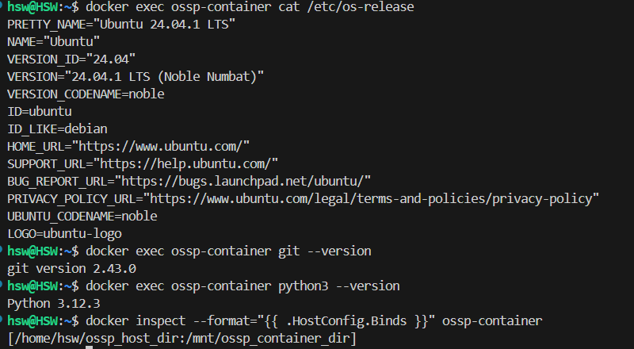

# Week 4 Assignment

- link of my repository
  >[week4](https://github.com/dobi-02/SWE_2021_41_2024_2_week_4)
  <pre>
  <code>
  def isHappy(n):
  numset = set()
  flag = True
  sum = n
  while flag:
    n = sum
    sum = 0
    while n>0:
      sum+=((n%10)*(n%10))
      n//=10
    if sum==1: break
    else:
      for i in numset:
        if i==sum:
          flag = False
          break
      numset.add(sum)
  return flag
  </code>
  </pre>
  
- description
  
  주어진 수 n이 0보다 큰 동안, sum에 n의 마지막 자리 숫자의 제곱을 더하고,
  \
  n을 10으로 나눈 몫을 n의 자리에 대입하기를 반복하여 n의 모든 자릿수의 제곱을 구합니다.
  \
  위 결과에서 나온 값을 set에 저장하고, 그 값의 모든 자릿수의 제곱을 구하는 과정을 재귀적으로 반복합니다.

  
  결과로 1이 나온다면 반복문에서 탈출하여 True를 반환하고,
  \
  반대로 set에 저장한 값이 다시 등장할 경우 반복문에서 탈출하여 False를 반환합니다.

___
# Week 5 Assignment
> ```python
> docker exec <your container> cat /etc/os-release
> ```
>> docker 컨테이너 내부에서 운영체제 정보를 출력합니다.

> ```python
> docker exec <your container> git --version
> ```
>> docker 컨테이너의 git 버전을 출력합니다.

> ```python
> docker exec <your container> python3 --version
> ```
>> docker 컨테이너의 python 버전을 출력합니다.

> ```python
> docker inspect --format="{{ .HostConfig.Binds }}" <your container>
> ```
>> docker 컨테이너에 bind된 폴더를 출력합니다.

### 실행 예시

